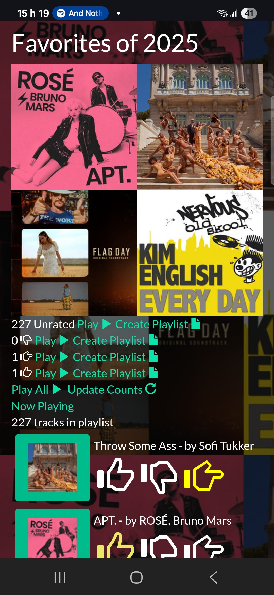

# Playlist Manager

This passion project helped resolve a personal challenge: how to whittle down a yearly playlist of 200-300 songs into 40 favorites. Each December I generate a "Top Songs of My Year" playlist. This wasn't easy in Spotify, having to manually drag favorites into a new playlist. This list often still had too many songs so I had to then remove tracks to get down to 40. I thought, "There must be a better way." So I decided to build an app through which I could review playlists and mark tracks with a rating scheme like:

* **Yes** - This song rocks and definitely should make my top 40. 
* **No** - A good tune, but not enough to represent my year.
* **Maybe** - A great tune, but needs more listens to decide if it makes the cut.

That's the app I wrote, which you can try out [here](https://russellsaintcyr.github.io/playlist-manager). It accesses the Spotify API and allows users to browse and manage playlists, using the rating system that tracks votes for Yes, No and Maybe (thumb up, thumb down, thumb neutral)

## Architecture
* Angular 18 frontend, with Bootstrap for UI components and layout
* GitHub Pages deployment with GitHub Actions CI/CD
* OAuth integration with Spotify API
* Modern TypeScript with Angular best practices

## Features
* Rate individual tracks with thumbs up, down, or neutral
* Create and manage playlists
* Playback controls
* Monitoring of "Now Playing"
* Album and artist information
* Search 
* Local storage for ratings and preferences

## Recent Updates
* Upgraded from Angular 10 to Angular 18, with control flow syntax, standalone components and no modules
* Modernized dependency injection with `inject()`
* Implemented `takeUntilDestroyed` for memory leak prevention
* Configured GitHub Pages for new Angular build system (dist/browser)
* Updated to TypeScript 5.5 with strict mode
* Replaced TSLint with ESLint
* Prettier code formatting

## Planned Features
* Angular 20 and signals
* Additional music services (Apple Music, YouTube Music, etc.)
* Firebase for authentication and user preference storage
* Enhanced playlist management tools
* Copying playlists between music services
* Playlist analytics (e.g. charts showing breakdown by genre, language, country, etc)
* React Native version for iOS and Android
* Progressive Web App (PWA) support

## Music Links
* <a href="https://open.spotify.com/playlist/0pqyzLEpqtt1AzHB0RGdvQ?si=f9c91a68de8240f3" target="_blank">My Top 40 of 2024</a>
* <a href="https://open.spotify.com/playlist/7xQIQYZZJ6Eu4SFbO0x64A?si=af413d9149b5480a" target="_blank">My Top 40 of 2023</a>
* <a href="https://open.spotify.com/playlist/6aOFbZYZTUO1qzsp5JS9v4?si=4f6f8f8c3ef5454a" target="_blank">My Top 40 of 2022</a>
* <a href="https://open.spotify.com/playlist/2o3Wbf3FYAyrApvzMfmz4d?si=380c5750bb414f4a" target="_blank">My Top 40 of 2021</a>
* <a href="https://open.spotify.com/playlist/0HIkuOQI4B0IIvj9fi65WP?si=9d7429d911a14663" target="_blank">My Top 40 of 2020</a>
* <a href="https://open.spotify.com/playlist/7FCJyM9RVxYYRYOlSffNrF?si=1551c5fd1ab14c81" target="_blank">My Top 40 of 2019</a>
* <a href="https://open.spotify.com/playlist/51wSFAsnu0LS7Z53Gy9L03?si=a8d26f54c17e444a" target="_blank">My Top 40 of 2018</a>
* <a href="https://open.spotify.com/playlist/2QNzk2n6iahh5kit6fQ2NM?si=b4ddad7a56f8483d" target="_blank">My Top 40 of 2017</a>
